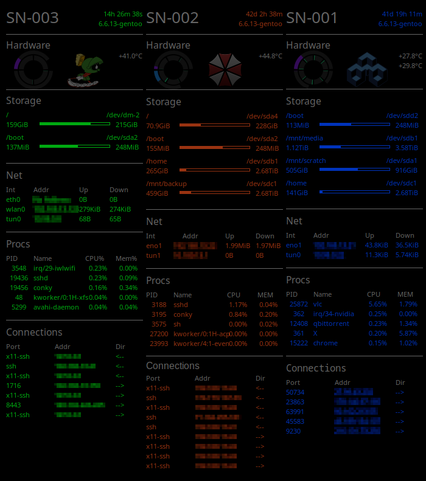
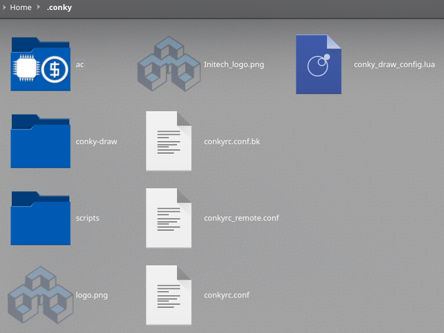

# Conky: Remote Monitoring Over X 
Use [Conky]( https://github.com/brndnmtthws/conky) to monitor remote servers.

*This config documentation, no original software* 

## Overview

  * Each machine is displayed in a standardized panel 
  * Each machine has a given color scheme for easy reading 
  * Panels are customized for each machine depending on hardware options etc 
    * Inner ring : CPU load
    * Outer ring graph(s) : RAM/RAM drives 
  * Execution is via ssh and X forwarding

## Config 
Place everything into a conky folder of choice 

Create needed config files
  * Examples of configs and scripts used in screenshot can be found in the associated folder(s) of this repo 
  * Files in the config folder are expected to be in the root (see screenshot)



### SSH Prerequisites

Ensure the ssh server is setup for X11 forwarding 

In sshd_config

```
Match User someuser
    X11Forwarding yes
```

Ensure you connect with X forwarding and connect with X forwarding (below). Alternately, you can permanently configure forwarding in your local .ssh/config file.

e.g.

```
Host SN-001 
    ForwardX11Trusted yes
    ForwardX11 yes
```
Please be sure to understand these options and use ones appropriate for your needs. 

## Usage 
Access the remote machine via ssh and X forwarding

```
ssh -Y targetmachine.com
cd ./conky 
conky -c conkyrc.conf >/dev/null 2>&1 & disown 
```

or create a startup script which for more advanced logic

e.g. the remote config has a differenct placement.

```
#!/bin/bash
if [[ $DISPLAY != ":0" ]]; then
        cd ~/.conky && conky -c conkyrc_remote.conf -d &>/dev/null & disown
else
        cd ~/.conky && conky -c conkyrc.conf -d &>/dev/null & disown
fi
```

### Extra Lazy 
Use your bashrc file to automatically start conky, choose the correct conky config, etc.

In .bashrc: 

``` 
# Conky
  # Start conky if local login and not running
if [ -z $(pidof conky) ] && [ $(echo $DISPLAY) = ":0" ]; then
  ~/Scripts/conkstart.sh 
fi
``` 

## Resources 
These resources are used in the examples above.
  * [Conky](https://github.com/brndnmtthws/conky)
  * [Conky-Draw](https://github.com/fisadev/conky-draw)


